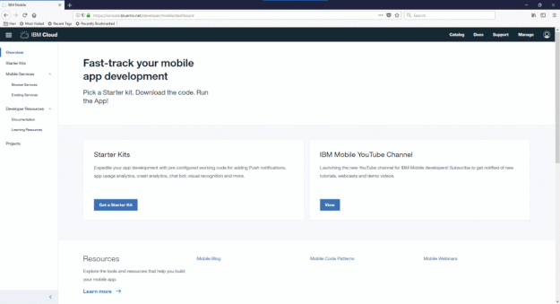

---

copyright:
  years: 2015, 2017, 2018, 2019
lastupdated: "2019-02-19"

---

{:shortdesc: .shortdesc}
{:new_window: target="_blank"}
{:tip: .tip}
{:pre: .pre}
{:codeblock: .codeblock}
{:screen: .screen}
{:javascript: .ph data-hd-programlang='javascript'}
{:java: .ph data-hd-programlang='java'}
{:python: .ph data-hd-programlang='python'}
{:swift: .ph data-hd-programlang='swift'}

# Getting started tutorial
{: #gstutorial}

In this tutorial, we introduce the mobile starter kit/service and go through the process of [building mobile apps on {{site.data.keyword.cloud_notm}}](https://cloud.ibm.com/developer/mobile/dashboard).
{: shortdesc}

## Step 1: Getting a free {{site.data.keyword.cloud_notm}} account
{: #free-account}

Create an account on {{site.data.keyword.cloud_notm}} to try Mobile Services for free with no time restrictions. [Sign-up for free ](https://cloud.ibm.com/registration/){: new_window}. You'll receive an email to confirm and activate your account.

## Step 2: Finding a starter kit or pick a service
{: #access-console}

After you activate your account and log in, pick a Mobile starter kit that fits your needs. You can also start from a blank project. Alternately select from the list of services you want to use. This creates a Project. A project provides resources to your applications.

## Next steps: Starting to code

You're ready to go. Your project has the details that you need.

Use the link in the Mobile Services dashboard to download the source code of a scaffolder mobile app. You can use this as a starting point or pick code pieces from it to integrate into your pre-existing app. 

## Service Credentials

Based on your selection, either a new service instance is created or an existing service instance you have picked is used to get the credentials to connect to the service. The service credentials are unique to your service instance and should be guarded well and not checked in to a public git repo. The service credentials are made available in the downloaded mobile app source code as well as displayed on the project overview page. Now you are ready to start building your Mobile app with {{site.data.keyword.cloud_notm}}.
